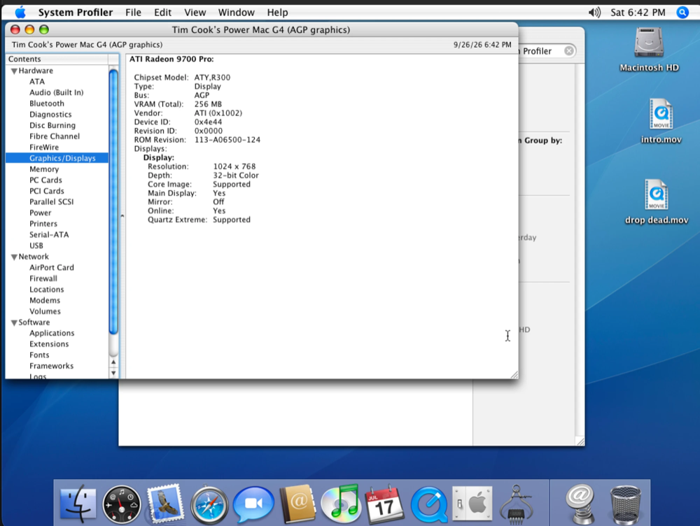
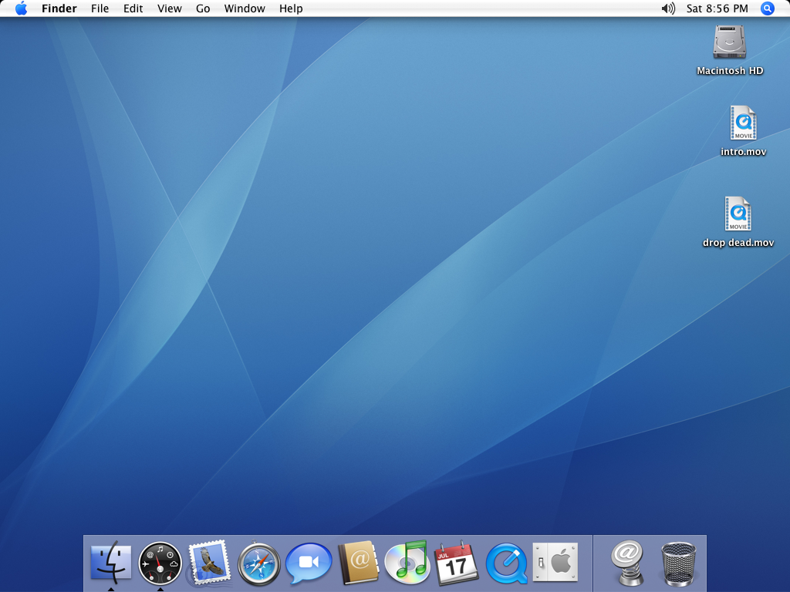

# ppcosxkvm

**Run Mac OS X Tiger (the PowerPC version) on your Apple Silicon Mac, with
working 3D graphics.**

Old PowerPC Macs and their software, back on a modern Mac: the Aqua desktop
with Quartz Extreme, Core Image and OpenGL apps, accelerated by your Mac's
own GPU.



## What makes it different

Other PowerPC emulators give Tiger a simple "dumb" screen, so everything
graphical is drawn slowly by the emulated CPU, and Quartz Extreme and Core
Image are switched off.

ppcosxkvm emulates a real graphics card that Tiger already knows: the
**ATI Radeon 9700 PRO**. Tiger uses Apple's own driver for it, exactly as
on a real Power Mac G4. Everything that driver asks the card to draw is
handed to your Mac's GPU through Metal.

* ✅ **Quartz Extreme**: windows and the Dock composited by the GPU
* ✅ **Core Image**: reported as supported, with the programmable
  shaders it needs
* ✅ **OpenGL apps**: e.g. Chess, with depth, anti-aliasing and textures
* ✅ **Easy to use**: one line to install, one word to start

## What you need

* 💻 A Mac with **Apple Silicon** (M1 or newer)
* 🍺 **[Homebrew](https://brew.sh)** (the installer tells you if it's missing)
* 💿 **Mac OS X Tiger for PowerPC**, which you provide yourself. Either:
  * a Tiger **install DVD image** (`.iso`, `.dmg`, `.cdr` or `.toast`), or
  * a Tiger **disk you already have** from another emulator, such as UTM,
    VMware, VirtualBox or a raw image
* 📦 About **25 GB** of free disk space

## Install

Open **Terminal** and paste:

```bash
curl -fsSL https://raw.githubusercontent.com/linuxkid473/ppcosxkvm/main/install.sh | bash
```

That's it. It takes a few minutes the first time, and when it's done you
have a new `ppcosx` command. (If Terminal says `ppcosx: command not found`,
open a new Terminal window.)

## Set up Mac OS X

Pick **one**:

**A. Install Tiger from a DVD image**

```bash
ppcosx install ~/Downloads/MacOSX-Tiger.iso
```

A window opens with the Tiger installer. First open **Utilities → Disk
Utility**, erase the hard disk as *Mac OS Extended (Journaled)*, then
install onto it. The [step-by-step guide](docs/GETTING-STARTED.md#3a-install-tiger-from-a-dvd-image)
walks through every screen.

**B. Use a Tiger disk you already have**

```bash
ppcosx import ~/VMs/Tiger.vmdk        # also .qcow2 .vdi .vhd .img, or a UTM .utm
```

Your original file is copied and never changed.

## Start it

```bash
ppcosx
```



Other handy ways to start it:

| Type this | To do this |
|---|---|
| `ppcosx` | Start Mac OS X with 3D graphics |
| `ppcosx --vga` | **Safe mode**: simple graphics, if something looks wrong |
| `ppcosx --attach-dvd ~/Discs/App.dmg` | Start with a CD/DVD image inserted, e.g. to install software |
| `ppcosx --ram 2048` | Give it more memory (up to 2048 MB) |
| `ppcosx --snapshot` | Try something risky: nothing you do is saved |
| `ppcosx doctor` | Check that everything is set up correctly |
| `ppcosx update` | Get the latest version |
| `ppcosx help` | See every command and option |

## Good to know

* 🖱️ **Mouse stuck in the window?** Press **Ctrl + Option + G** to get it
  back.
* ⏻ **Turning it off:** use **Apple menu → Shut Down** inside Mac OS X, like a real
  Mac. Closing the window is like pulling the power plug.
* 💾 **Save a restore point:** with the VM off, run
  `ppcosx snapshot save my-backup`, and later
  `ppcosx snapshot restore my-backup`.
* 🐢 **Speed:** the whole PowerPC processor is emulated in software, so
  expect roughly a G4-era Mac. The graphics are fast, heavy apps are not.
* 📁 **Your files** (the Mac OS X disk and settings) live in `~/.ppcosx/vm`.
* ✅ **Is 3D really working?** In Mac OS X, open Apple menu → About This Mac →
  More Info → Graphics/Displays. It should say **ATI Radeon 9700 Pro**, with
  Quartz Extreme and Core Image *Supported*.

## Something not working?

1. Run `ppcosx doctor`. It checks the usual suspects.
2. Try safe mode: `ppcosx --vga`.
3. Look in the [troubleshooting guide](docs/TROUBLESHOOTING.md).
4. Still stuck? [Open an issue](https://github.com/linuxkid473/ppcosxkvm/issues)
   with the output of `ppcosx doctor`, your Tiger version, and a
   screenshot.

## Status

Tested on **Mac OS X 10.4.11**. For the best results, update Tiger to
10.4.11 with Apple's *10.4.11 Combo Update (PPC)*.

| | |
|---|---|
| ✅ Works | Desktop with Quartz Extreme, Core Image, OpenGL (Chess), hardware cursor, keyboard and mouse |
| 🟡 Should work, less tested | Installing from a DVD image, networking, sound, resolutions other than 1024×768 |
| ❌ Not yet | Leopard (10.5), multiple CPUs, video decode acceleration |

## More documentation

* 📘 [Getting started](docs/GETTING-STARTED.md): the full walkthrough
* 🧰 [Using ppcosx](docs/USAGE.md): every command and option, moving files in and out
* 🩺 [Troubleshooting](docs/TROUBLESHOOTING.md)
* 🔌 [The ATI ROM](docs/ROM.md): optional, and why
* 🔬 [How it works](docs/HOW-IT-WORKS.md): the emulated Radeon and the Metal translation
* 🛠️ [Developing](docs/DEVELOPING.md): building from source, debug switches, tests

## Legal

* **No Apple or ATI software is included.** You provide Mac OS X yourself.
* The scripts and docs here are GPL-2.0-or-later ([LICENSE](LICENSE)).
  The QEMU fork is GPL-2.0, like QEMU.
* The bundled [firmware](firmware/README.md) is free software (OpenBIOS,
  QemuMacDrivers and classicvirtio).

## Thanks

Built on [QEMU](https://www.qemu.org) and
[Spartan0285/poweremu-qemu](https://github.com/Spartan0285/poweremu-qemu),
whose Radeon 9200 emulation this project extends to the Radeon 9700, with
the hardware cursor driver from [PowerEmu](https://github.com/Spartan0285/PowerEmu).
It also uses [OpenBIOS](https://github.com/openbios/openbios) as shipped by
[UTM](https://github.com/utmapp/UTM),
[QemuMacDrivers](https://github.com/ozbenh/QemuMacDrivers),
[classicvirtio](https://github.com/elliotnunn/classicvirtio), and Mesa's
R300 documentation.
